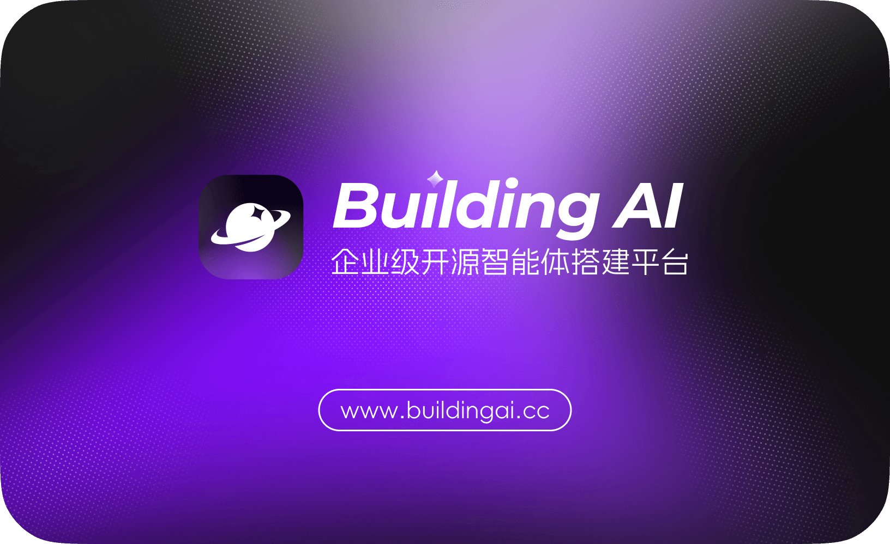
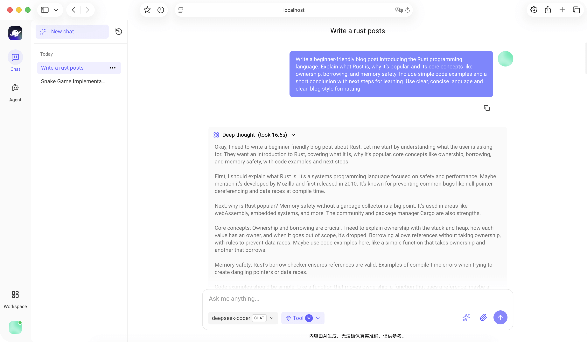
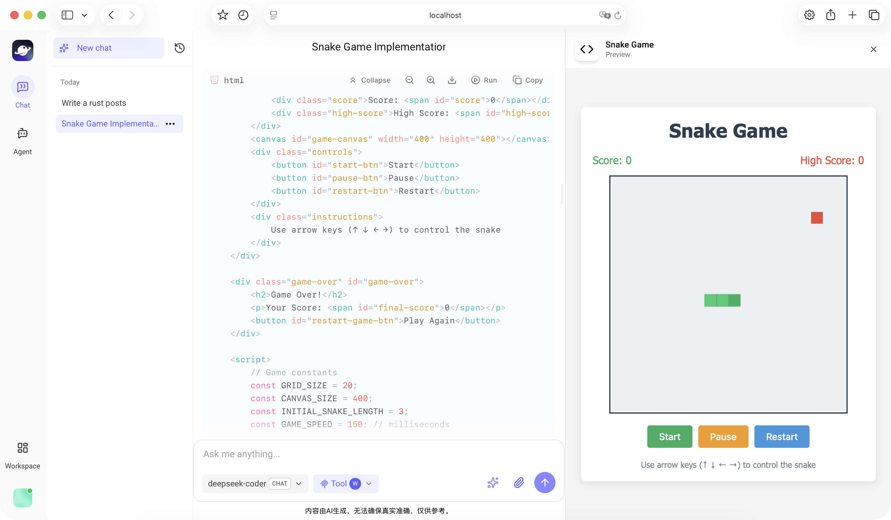
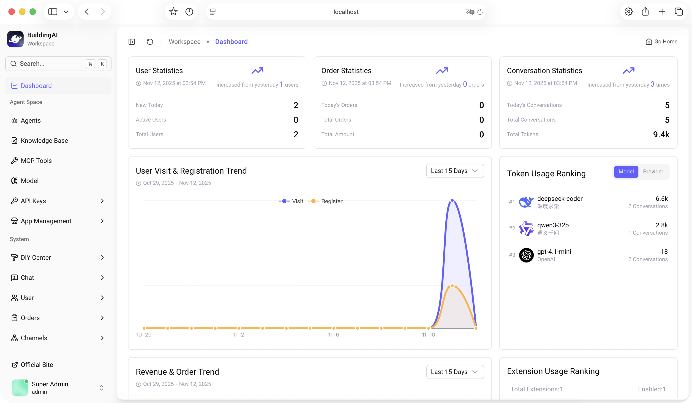
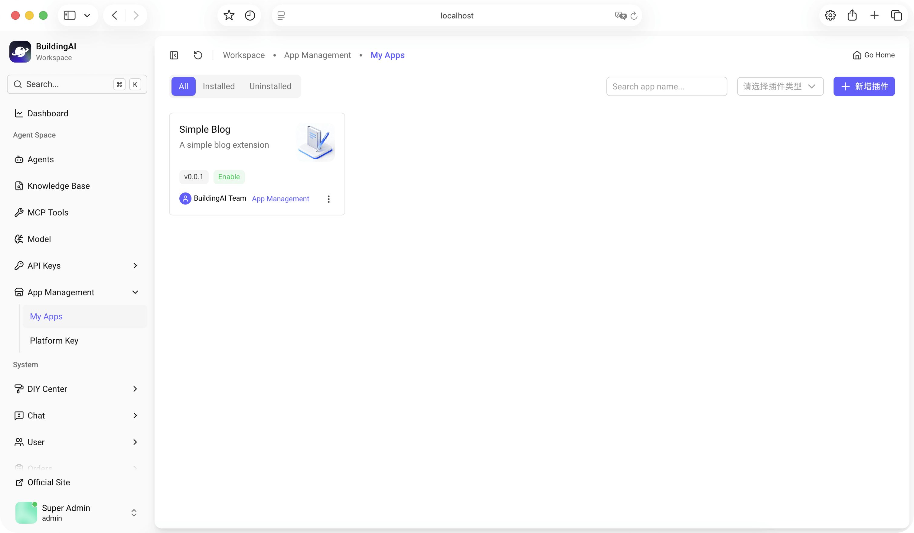
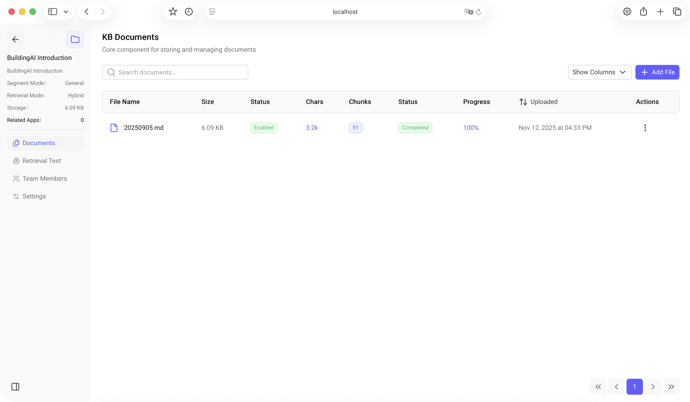

<p align="center">
  <a href="https://www.oscarsai.world
/" target="_blank"></a>
</p>

<p align="center">
<a href="http://demo.oscarsai.world
/" target="_blank">Live Demo</a>｜
<a href="https://www.oscarsai.world
/">Official Website</a>｜
<a href="./README.zh-CN.md">中文文档</a>
</p>

<p align="center">
  <a href="https://nestjs.com/"></a>
  <a href="https://typeorm.io/"></a>
  <a href="https://www.postgresql.org/"></a>
  <a href="https://www.typescriptlang.org/"></a>
  <a href="https://turbo.build/"></a>
  <a href="https://vuejs.org/"></a>
  <a href="https://vitejs.dev/"></a>
  <a href="https://ui.nuxt.com/"></a>
  <a href="https://nuxt.com/"></a>
</p>

oscarsai is an enterprise-grade open-source intelligent agent platform designed for AI developers,
AI entrepreneurs, and forward-thinking organizations. Through a visual configuration interface (Do
It Yourself), you can build native enterprise AI applications without code. The platform offers
native capabilities such as intelligent agents, MCP, RAG pipelines, knowledge bases, large-model
aggregation, and context engineering, along with user registration, membership subscriptions,
compute billing, and other business operations.

## Quick Start

> Before installing `oscarsai`, make sure your device meets the minimum requirements:
>
> - **CPU**: ≥ 2 cores
> - **Memory**: ≥ 4 GB RAM
> - **Storage**: ≥ 5 GB free space

Deploying oscarsai with [Docker](https://www.docker.com/) is the simplest and most stable option.
Ensure that [Docker](https://www.docker.com/) and [Docker Compose](https://docs.docker.com/compose/)
are already installed on your device.

```bash
# Enter the project directory (replace with your directory name)
cd oscarsai
# Copy and customize the environment variables
# In production, update the APP_DOMAIN value in the .env file to your own domain.
cp .env.example .env
# Start the application with Docker
docker compose up -d
```

Wait for images to be pulled and the project to build. Depending on your device performance and
network conditions, this usually takes about 5–10 minutes. You can check the build progress in the
Node.js container logs; once an accessible URL appears, the project has started successfully.

After the project has fully started, open your browser and visit
[http://localhost:4090/install](http://localhost:4090/install) to complete the initial setup wizard.

For other deployment methods, see our
[Deployment Guide](https://www.oscarsai.world
/docs/introduction/install).

## Key Features

- **AI Conversations**: Conversational AI and text generation powered by large language models, with
  support for multimodal models.
- **AI Agents**: Create agents with memory, goals, and tool usage for autonomous task execution.
- **Knowledge Base**: Build knowledge bases from documents with vector search and RAG-enhanced
  generation.
- **MCP Integration**: Call MCP tools via SSE and Streamable HTTP protocols.
- **Model Management**: Integrate mainstream large models under a unified API specification.
- **Extension Mechanism**: Expand system capabilities and AI skills by installing extensions.
- **Billing & Payments**: Built-in membership management, billing, and payment features ready to
  use.

## Screenshots

 
 


## Contribution

If you would like to contribute, please
[open an issue](https://github.com/BidingCC/oscarsai/issues/new/choose) or
[submit a pull request](https://github.com/BidingCC/oscarsai/pulls) on GitHub.

You can also reach us through the [community](https://oscarsai.world
/docs/introduction/community) or
the [Q&A forum](https://www.oscarsai.world
/question).

## Star History

[](https://www.star-history.com/#BidingCC/oscarsai&Date)

## Privacy Policy

This project **only collects anonymized usage statistics with your consent**. For details, see
[PRIVACY_NOTICE.md](./PRIVACY_NOTICE.md).

## License

[Apache License 2.0](./LICENSE)
